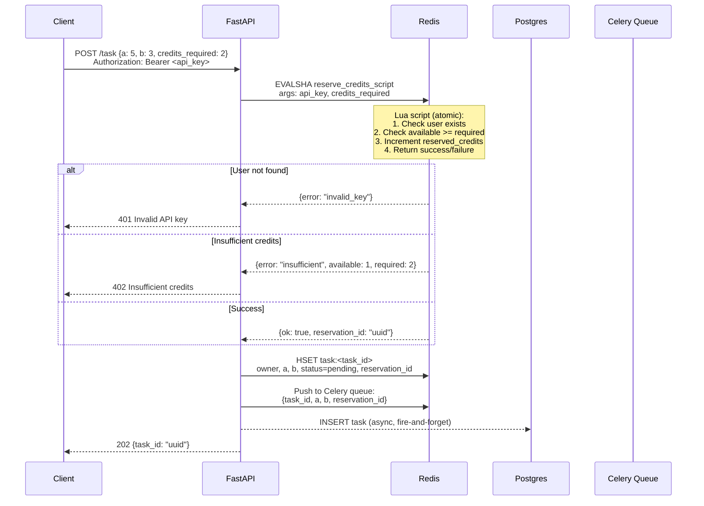
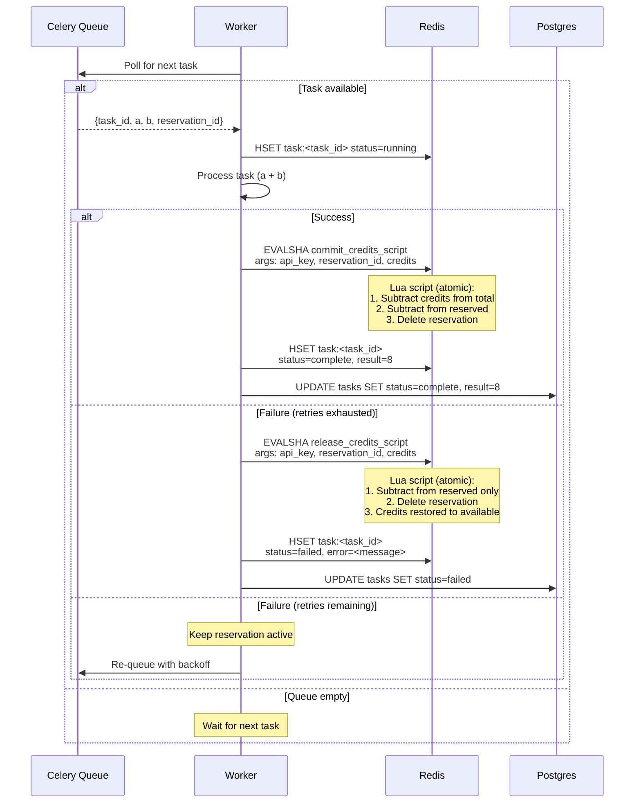
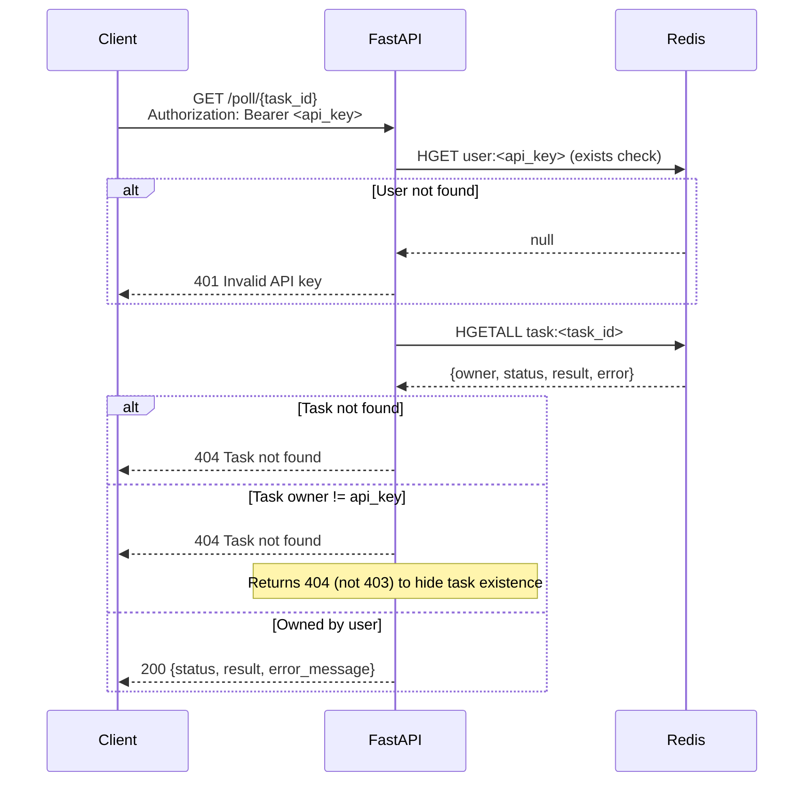
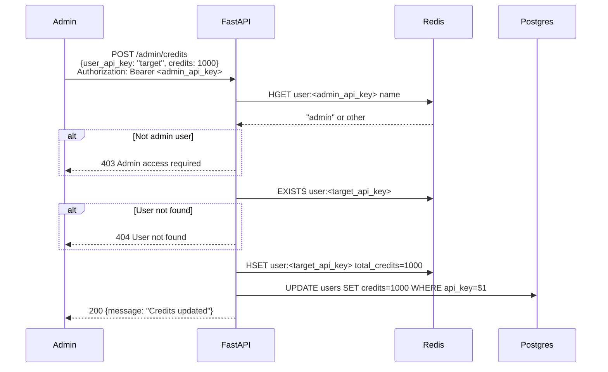
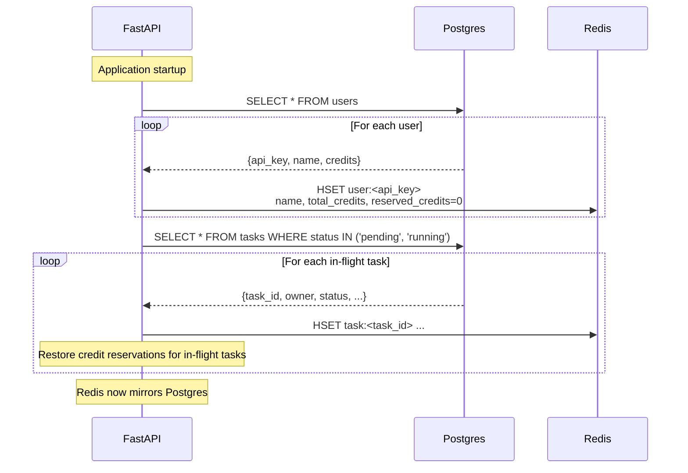
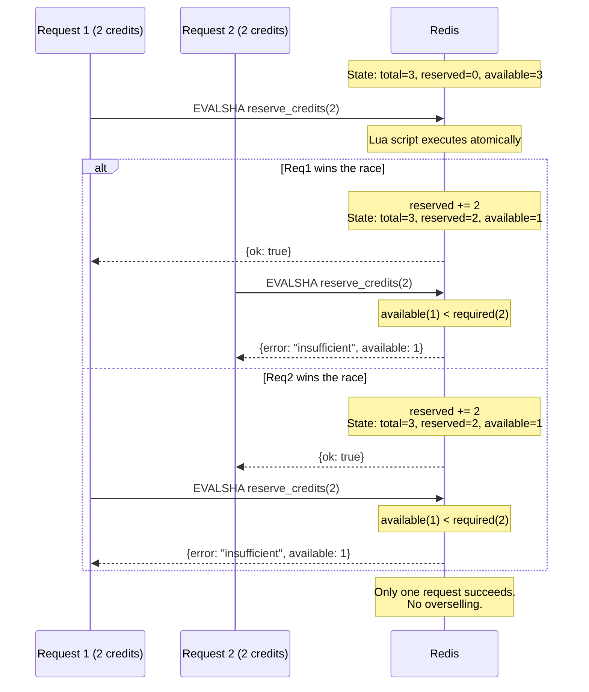

# Sequence Diagrams

## Architecture Overview

### Storage Responsibilities

| Store | Data | Purpose |
|-------|------|---------|
| **Redis** | `user:<api_key>` hash | Real-time credit tracking (available, reserved) |
| **Redis** | `task:<task_id>` hash | Task state and metadata |
| **Redis** | Celery task queue | Task message broker |
| **PostgreSQL** | `users`, `tasks` | Persistent storage, audit log, recovery source |

### Credit Model

```
available_credits = total_credits - reserved_credits

Example: User has 3 total credits
- Job A (2 credits) arrives  → reserve 2  → available: 1, reserved: 2
- Job B (2 credits) arrives  → reject     → available: 1 < required: 2
- Job A completes            → commit 2   → total: 1, reserved: 0
```

---

## 1. Task Submission Flow

`POST /task` - Single Redis call for auth + credit reservation.



---

## 2. Worker Processing Flow

Worker processes task, then commits or releases reserved credits.



---

## 3. Poll for Result Flow

`GET /poll/{task_id}` - Fast Redis lookup, no Postgres needed.



---

## 4. Admin Update Credits Flow

`POST /admin/credits` - Update Redis (real-time) and Postgres (persistent).



---

## 5. Startup Sync Flow

On API startup, sync Redis from Postgres to ensure consistency.



---

## Race Condition Example

**Scenario:** User has 3 credits. Two requests arrive simultaneously, each needing 2 credits.



---

## Lua Scripts (Redis Atomic Operations)

### reserve_credits

```lua
-- KEYS[1] = user:<api_key>
-- ARGV[1] = credits_required
-- ARGV[2] = reservation_id

local total = tonumber(redis.call('HGET', KEYS[1], 'total_credits'))
if not total then
    return {err = 'invalid_key'}
end

local reserved = tonumber(redis.call('HGET', KEYS[1], 'reserved_credits') or 0)
local available = total - reserved
local required = tonumber(ARGV[1])

if available < required then
    return {err = 'insufficient', available = available, required = required}
end

redis.call('HINCRBY', KEYS[1], 'reserved_credits', required)
redis.call('HSET', 'reservation:' .. ARGV[2], 'api_key', KEYS[1], 'credits', required)

return {ok = true, reservation_id = ARGV[2]}
```

### commit_credits

```lua
-- Called on task SUCCESS: deduct from total, clear reservation
local api_key = redis.call('HGET', 'reservation:' .. ARGV[1], 'api_key')
local credits = tonumber(redis.call('HGET', 'reservation:' .. ARGV[1], 'credits'))

redis.call('HINCRBY', api_key, 'total_credits', -credits)
redis.call('HINCRBY', api_key, 'reserved_credits', -credits)
redis.call('DEL', 'reservation:' .. ARGV[1])

return {ok = true}
```

### release_credits

```lua
-- Called on task FAILURE: just clear reservation, credits restored
local api_key = redis.call('HGET', 'reservation:' .. ARGV[1], 'api_key')
local credits = tonumber(redis.call('HGET', 'reservation:' .. ARGV[1], 'credits'))

redis.call('HINCRBY', api_key, 'reserved_credits', -credits)
redis.call('DEL', 'reservation:' .. ARGV[1])

return {ok = true}
```
