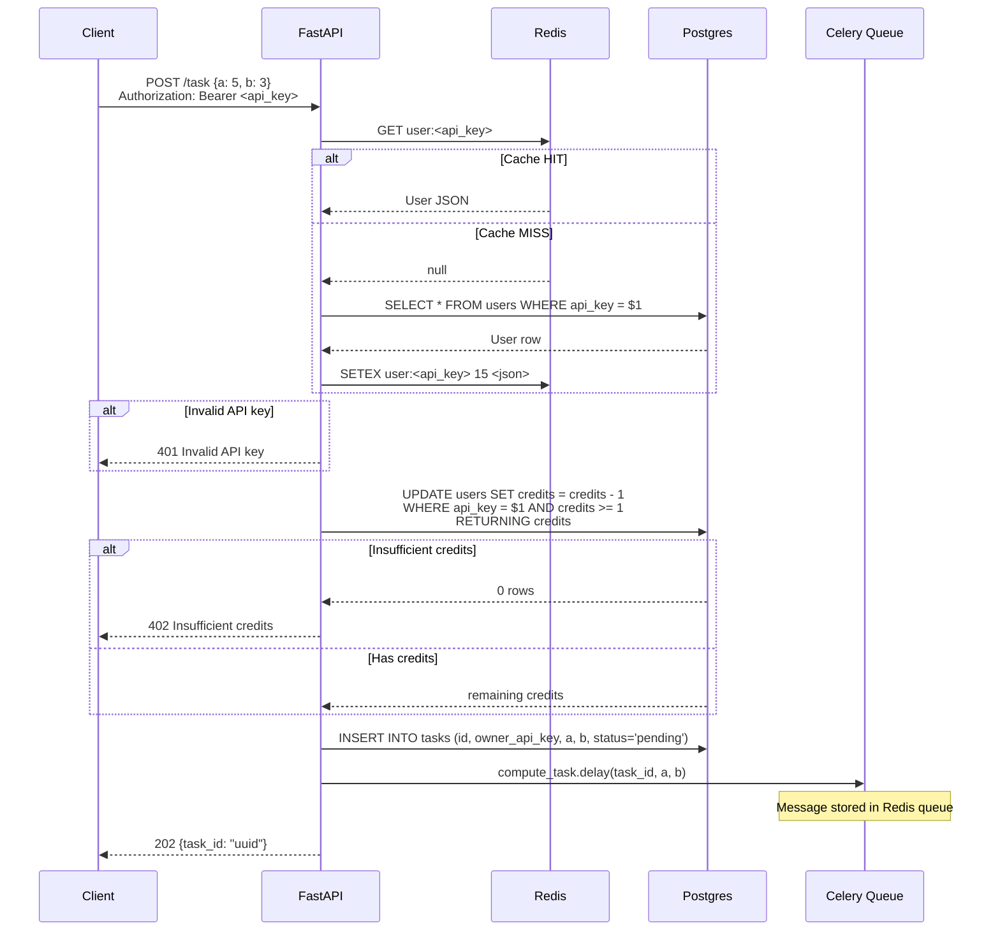
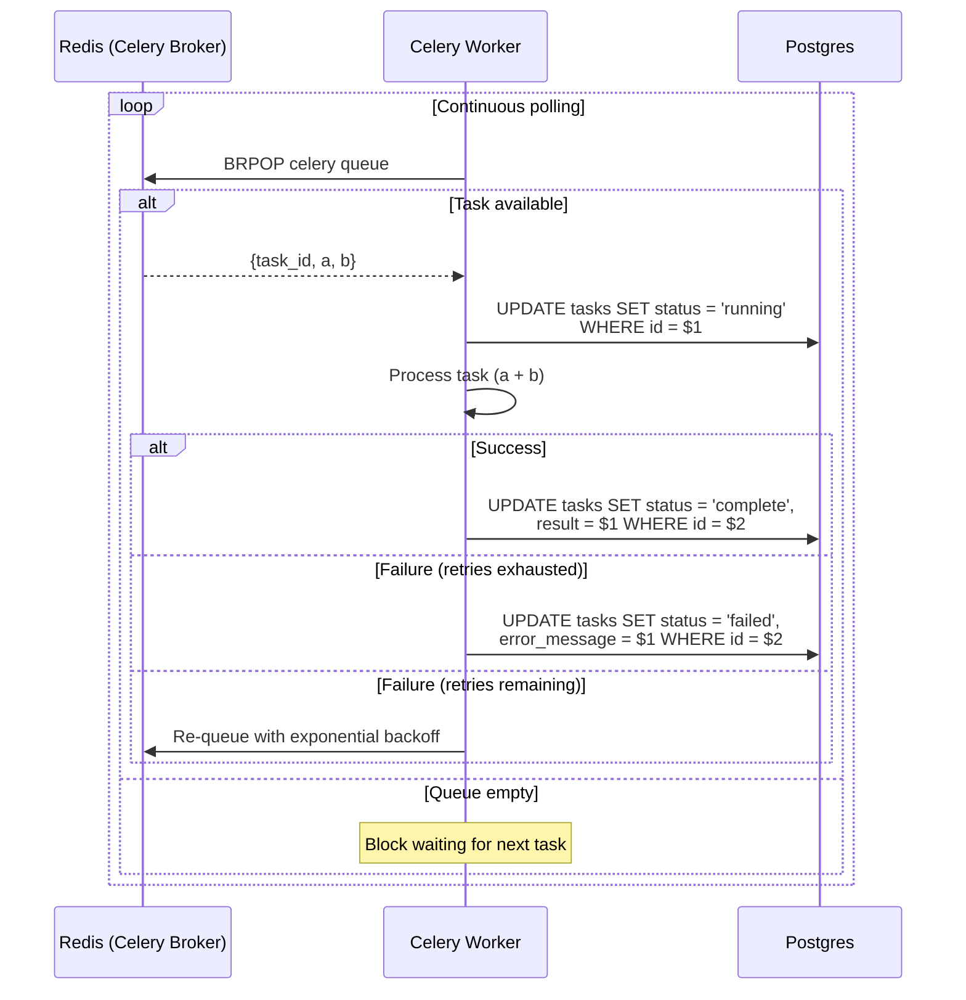
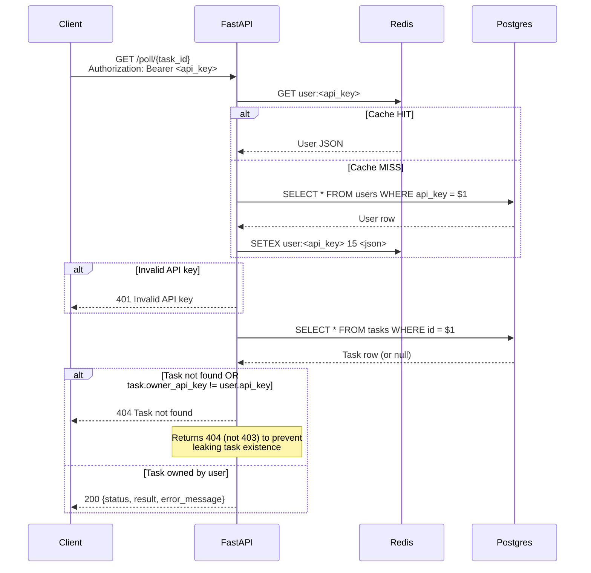
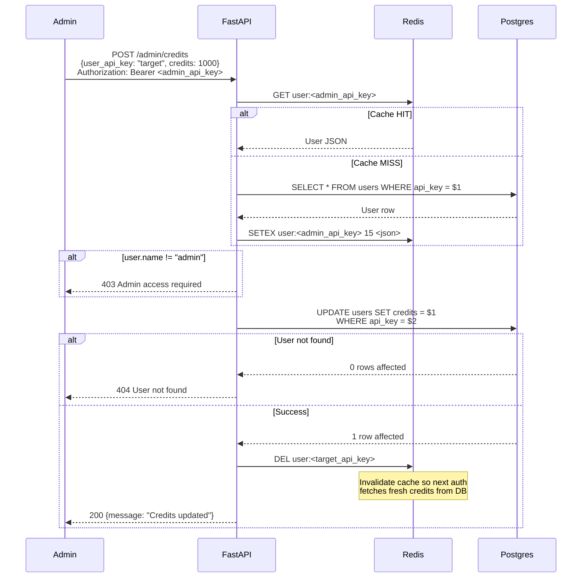

# Sequence Diagrams

## 1. Task Submission Flow

`POST /task` - Includes authentication, credit validation, and task creation.

---

## 2. Worker Processing Flow

Celery worker picks up tasks from Redis queue and processes them.

---

## 3. Poll for Result Flow

`GET /poll/{task_id}` - Check task status with ownership validation.

---

## 4. Admin Update Credits Flow

`POST /admin/credits` - Admin-only endpoint to set user credits.

---

## Storage Responsibilities

| Store | Data | Purpose |
|-------|------|---------|
| **PostgreSQL** | `users`, `tasks` | Persistent source of truth |
| **Redis** | `user:<api_key>` | Auth cache (15s TTL) |
| **Redis** | Celery queues | Task message broker |
